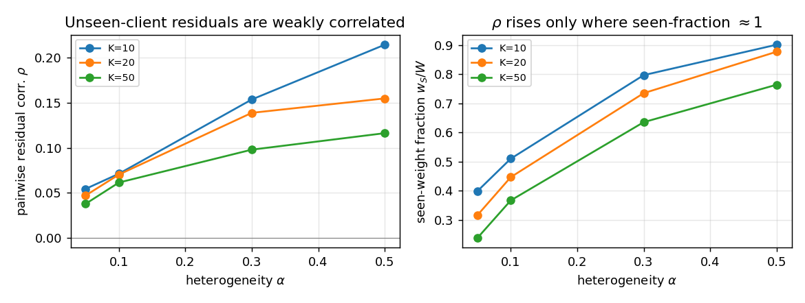
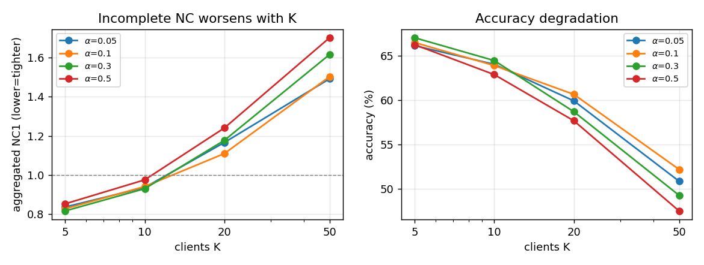
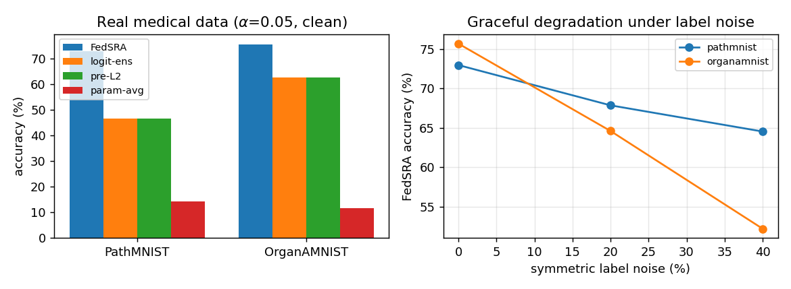
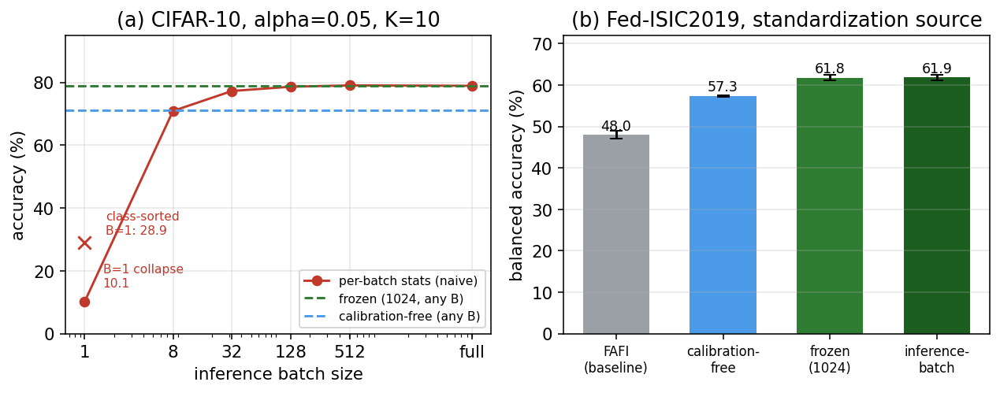
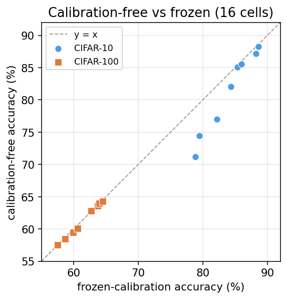
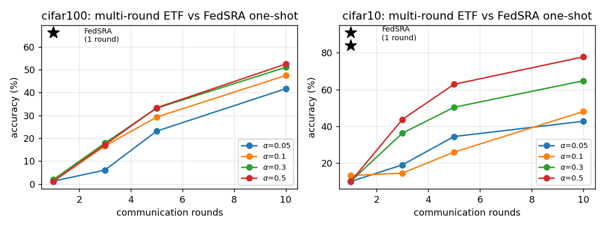

# Detailed experimental results

Full supporting numbers for FedSRA. Runs are from scratch and use seeds 0, 42,
123 unless noted. Scripts for every table below live in `src/` and
`experiments/`.

## 1. Aggregation reliability: do unseen-class residuals cancel?

RGA sums per-client z-scored features with sqrt(sample-count) weights. A client
that never saw a class can still emit a non-zero output on it, so we measure, per
class, that residual and its cross-client correlation on three data families:
CIFAR-10/100 (synthetic Dirichlet skew), MedMNIST colorectal histology, and the
natural Fed-ISIC federation. Script: `src/eval_residual_diag.py`,
`experiments/residdiag_*.py`.

- Per-client residual on an unseen class: 0.32 to 0.64 of the feature magnitude
  (clearly non-zero).
- After removing each client's own mean (RGA's standardization step), the
  remaining residual has cross-client correlation 0.04 to 0.11 (near 0), so the
  weighted sum cancels it.
- The correlation is smallest exactly where coverage is worst. On CIFAR it rises
  from 0.05 to 0.21 as the fraction of clients that saw the class rises from 0.3
  to 0.9; the correct-class signal stays positive and tracks accuracy.
- Naive (un-standardized) aggregation retains only the seen-client weight
  fraction of the signal, 0.24 to 0.40 under the most severe skew, which matches
  its 4.6 to 36.6 point gap to oracle aggregation (Fig. 3 of the paper).

Cancellation needs only weak cross-client correlation, strictly weaker than
per-client zero mean.

## 2. Neural-collapse threshold vs client count

Aggregated NC1 = within-class scatter / between-class separation; above 1.0 the
classes are no longer cleanly separated. Script: `src/measure_fednc.py`,
`experiments/ncsweep_medmnist.py`.

### CIFAR-100 (100 classes), seed 42

| alpha | metric | K=5 | K=10 | K=20 | K=50 |
|-------|--------|-----|------|------|------|
| 0.05 | NC1 | 0.837 | 0.937 | **1.166** | 1.491 |
| 0.05 | acc% | 66.13 | 64.03 | 59.91 | 50.86 |
| 0.10 | NC1 | 0.828 | 0.941 | **1.109** | 1.502 |
| 0.10 | acc% | 66.48 | 63.89 | 60.64 | 52.19 |
| 0.30 | NC1 | 0.817 | 0.930 | **1.177** | 1.615 |
| 0.30 | acc% | 67.02 | 64.45 | 58.69 | 49.27 |
| 0.50 | NC1 | 0.853 | 0.976 | **1.240** | 1.700 |
| 0.50 | acc% | 66.24 | 62.87 | 57.67 | 47.51 |

NC1 crosses 1.0 between K=10 and K=20 (about K=20) at every alpha. The sharpest
accuracy drop is always K=20 to 50: 9.05, 8.45, 9.42, 10.16 points.

### PathMNIST (MedMNIST colorectal histology, 9 classes), alpha 0.05, seed 42

| K | 5 | 10 | 20 | 50 |
|---|---|----|----|----|
| aggregated NC1 | 0.464 | 0.385 | 0.277 | 0.300 |
| accuracy % | 78.62 | 77.17 | 81.77 | 84.43 |

With only 9 classes, NC1 never crosses 1.0 through K=50. The threshold is set by
the class count, not universal.

## 3. Medical and natural federations

Against independently trained baselines (a real shared-initialization one-shot
FedAvg, CE ensembles, and FAFI), three seeds, from scratch. Scripts:
`experiments/medmnist_realbaseline.py`, `experiments/fedisic_fedsra.py`,
`experiments/fedisic_fafi.py`.

### MedMNIST, Dirichlet skew: Top-1 margin over FAFI

| alpha | 0.05 | 0.1 | 0.3 | 0.5 |
|-------|------|-----|-----|-----|
| colorectal histology (PathMNIST) | +15.6 | +14.7 | +1.3 | -0.9 |
| abdominal-organ CT (OrganAMNIST) | +7.1 | +1.4 | +0.8 | -0.3 |

At the most severe skew (alpha 0.05), absolute Top-1 is 82.2 / 84.5% (FedSRA) vs
66.5 / 77.4% (FAFI), 54.6 / 64.2% (CE ensemble), 12.7 / 16.4% (one-shot FedAvg).
Under 20% / 40% label noise FedSRA stays best or tied (PathMNIST 82.2 to 73.8 to
71.1%); under MedMNIST-C corruption it holds 59.9 / 66.1%.

### Fed-ISIC2019 (6 real FLamby centers, 8 classes, 144x144, natural partition)

Pooled test, 3-seed mean +/- std, from scratch, 200 epochs.

| Method | Bal-Acc | macro-AUC | worst-class |
|--------|---------|-----------|-------------|
| one-shot FedAvg (real, shared init) | 23.1 +/- 1.3 | 80.5 +/- 1.3 | 0.0 +/- 0.0 |
| CE ensemble (sqrt-n) | 37.0 +/- 1.2 | 89.6 +/- 0.2 | 3.7 +/- 0.3 |
| FAFI (strongest baseline) | 48.0 +/- 1.0 | **90.9 +/- 0.2** | 23.4 +/- 0.8 |
| FedSRA (client-local moments) | 57.3 +/- 0.2 | 86.6 +/- 0.1 | 39.7 +/- 1.9 |
| FedSRA (inference-batch) | **61.9 +/- 0.7** | 87.7 +/- 0.1 | **50.0 +/- 1.5** |

Baselines collapse toward the majority class (they lead only on macro-AUC, a
ranking metric a majority predictor scores well on). Trained to convergence,
baselines saturate by epoch 20 while FedSRA converges near epoch 160 to 200, so
at 200 epochs FedSRA's lead over FAFI grows from +11.9 to +13.9 points and
one-shot FedAvg degrades with more training.

## 4. Feature standardization and single-sample inference

Eq. (4) statistics are a per-feature mean and standard deviation over samples
(256 dimensions, epsilon 1e-8). The submitted results use the full test batch.
Scripts: `src/eval_batch_zscore.py`, `experiments/fedisic_frozen.py`.

### 4.1 The default is batch-dependent (CIFAR-10, K=10, alpha 0.05)

| stats source | full batch | B=128 | B=32 | B=8 | B=1 | class-sorted stream |
|--------------|-----------|-------|------|-----|-----|---------------------|
| per-batch (naive) | 78.93 | 78.64 | 77.28 | 70.92 | 10.07 | 28.88 |

Per-batch statistics collapse at batch size 1 and under class-sorted streams.
Both batch-independent variants below are flat across batch size, and on
Fed-ISIC the frozen variant matches the full-batch number.

### 4.2 Batch-independent variant 1: frozen statistics (1,024 unlabeled samples)

Estimated once, applied per sample, batch-size independent. Accuracy (%),
calibration-free (client-local training moments) shown alongside for comparison.
Columns: trainstats = calibration-free, frozen = 1,024-sample buffer,
global = full-test batch.

| dataset | alpha | K | calibration-free | frozen | full-batch |
|---------|-------|---|------------------|--------|------------|
| CIFAR-10  | 0.05 | 10 | 71.16 | 78.81 | 78.93 |
| CIFAR-10  | 0.05 | 20 | 74.45 | 79.50 | 79.55 |
| CIFAR-10  | 0.10 | 10 | 82.03 | 84.38 | 84.55 |
| CIFAR-10  | 0.10 | 20 | 77.01 | 82.16 | 82.16 |
| CIFAR-10  | 0.30 | 10 | 87.19 | 88.21 | 87.93 |
| CIFAR-10  | 0.30 | 20 | 85.09 | 85.35 | 85.25 |
| CIFAR-10  | 0.50 | 10 | 88.24 | 88.66 | 88.65 |
| CIFAR-10  | 0.50 | 20 | 85.53 | 86.01 | 85.97 |
| CIFAR-100 | 0.05 | 10 | 63.56 | 63.71 | 63.86 |
| CIFAR-100 | 0.05 | 20 | 59.44 | 59.94 | 59.77 |
| CIFAR-100 | 0.10 | 10 | 64.00 | 63.91 | 63.90 |
| CIFAR-100 | 0.10 | 20 | 60.09 | 60.59 | 60.66 |
| CIFAR-100 | 0.30 | 10 | 64.30 | 64.49 | 64.43 |
| CIFAR-100 | 0.30 | 20 | 58.47 | 58.69 | 58.60 |
| CIFAR-100 | 0.50 | 10 | 62.79 | 62.72 | 62.76 |
| CIFAR-100 | 0.50 | 20 | 57.52 | 57.49 | 57.64 |

Frozen statistics recover the full-batch accuracy within 0.5 point in every cell
and hold at batch size 1. Calibration-free (each client uploads its own
training-feature mean/std, no buffer and no extra round) matches frozen within
0.5 point across all CIFAR-100 cells; on CIFAR-10 it trails by up to 7.65 points
under the most severe skew and by under 0.5 point as skew relaxes.

Every CIFAR-100 cell sits on the diagonal (calibration-free equals frozen); the
CIFAR-10 gap appears only in the low-accuracy, severe-skew corner.

### 4.3 Fed-ISIC2019, balanced accuracy (3-seed mean +/- std)

| standardization source | Bal-Acc |
|------------------------|---------|
| inference-batch (full) | 61.88 +/- 0.65 |
| frozen (1,024 unlabeled) | 61.78 +/- 0.64 |
| calibration-free (client-local moments) | 57.34 +/- 0.17 |

Frozen statistics from 1,024 unlabeled samples essentially match the full-batch
number (61.8 vs 61.9) while being batch-size independent; the calibration-free
variant needs no target-domain data at all and still exceeds FAFI (48.0).

## 5. Serving cost and grouped merging

Inference evaluates every retained backbone, so cost grows linearly with K.
Scripts: `src/measure_efficiency.py`, `src/eval_grouped_merge_cost.py`.

| | latency B=256 | latency B=1 | peak memory |
|---|---|---|---|
| FedSRA, K=50 | 5.20 ms/img | 145 ms/img | 2,525 MB |
| single model | 0.07 ms/img | 2.8 ms/img | 366 MB |

Grouped merging (data-free: balanced grouping, cosine-threshold filter merging
within compatible architectures, then RGA across groups) on CIFAR-100, K=10,
alpha 0.05:

| groups G | accuracy | parameters | latency B=1 | memory | preprocessing |
|----------|----------|------------|-------------|--------|---------------|
| 10 | 63.7% | 113 M | 27.8 ms | 800 MB | 0 s |
| 5 | 40.4% | 169 M | 13.6 ms | 1243 MB | 323 s |
| 2 | 32.9% | 418 M | 18.1 ms | 2877 MB | 519 s |

It reduces the forward count but widens the models and loses accuracy, so it is a
trade-off, not a free reduction.

## 6. Reproducibility, ordering, and multi-round comparison

- **Seeds.** All 12 CIFAR-100 alpha x K cells use three seeds; standard
  deviation 0.12 to 0.83 point (mean 0.41). Fed-ISIC and MedMNIST also use three
  seeds. A released IntactOFL run stays below FAFI and FedSRA at every skew level
  (40.7% / 61.3% at alpha 0.05 / 0.5). Script: `src/run_grid.py`,
  `src/run_znorm_*.py`.
- **Ordering vs components.** Replacing RGA with matched pre-L2 / logit-ensemble
  aggregation (same backbone and ETF) loses 5 to 20 points at alpha <= 0.1, so
  the standardize, weight, aggregate, L2-normalize ordering drives the gain, not
  the components. Script: `src/eval_ablation_RIJ.py`.
- **Multi-round.** Official one-shot FedETF and FedLoGe stay near random on
  CIFAR-10/100 (about 10% and 1%) versus 79.9 to 91.0% (CIFAR-10) and 65.3 to
  66.5% (CIFAR-100) for FedSRA. A matched fixed-ETF FedAvg control still trails
  one-round FedSRA by at least 26 points after ten rounds under severe skew.
  Script: `src/train_multiround_etf.py`.

